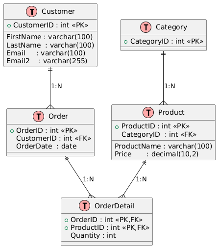

# 🏪 Sistema de Gestión de Bodega

## Integrantes

- Carrasco Choque, Arles Melvin
- Chancuaña Alvis, Klismann
- Hancco Soncco, Vladimir Jaward
- Hanccoccallo Achircana, Frank Duks
- Nina Suyo, Diego Claudio

## 📘 Resumen Ejecutivo

Este proyecto es una **aplicación móvil Android**, desarrollada en **Kotlin con Jetpack Compose**, diseñada para la **gestión eficiente de una bodega**.
La aplicación permite la administración completa de:

- **Productos** del almacén con funcionalidades CRUD (Crear, Leer, Actualizar, Eliminar)
- **Clientes** con datos de contacto y seguimiento de sus pedidos
- **Pedidos** con control de estado y detalles de venta

Una de las características clave es la **funcionalidad de importación de datos desde archivos CSV**, permitiendo la carga inicial de productos de manera masiva.
Además, la app incluye **consultas relacionales** para mostrar información detallada como pedidos de clientes específicos y relaciones de productos con pedidos, cumpliendo con los requerimientos de consultas tipo 1-n y n-m.

  
  

---

## 🖥️ Descripción de Interfaces Implementadas

A continuación se detallan las principales pantallas e interfaces de la aplicación:

### `MainScreen`

- **Propósito:** Pantalla principal con navegación de barra inferior.
- **Comportamiento Principal:** Muestra las tres secciones principales (Productos, Pedidos, Clientes) con un menú de navegación inferior y gestiona la lógica de navegación entre pantallas.

### `ProductListScreen`

- **Propósito:** Mostrar una lista completa de productos disponibles en la bodega.
- **Comportamiento Principal:** Presenta tarjetas con nombre, precio, stock y descripción. Incluye botón flotante para crear nuevos productos y botón para importar desde CSV.

### `AddEditProductScreen`

- **Propósito:** Crear o actualizar la información de un producto.
- **Comportamiento Principal:** Muestra formulario con campos para nombre, precio, stock y descripción. Incluye validación de datos y botones para guardar o cancelar.

### `OrderListScreen`

- **Propósito:** Mostrar una lista de todos los pedidos realizados.
- **Comportamiento Principal:** Presenta resumen de pedidos con información de cliente, estado y monto total. Incluye botón flotante para crear nuevos pedidos.

### `NewOrderScreen`

- **Propósito:** Crear un nuevo pedido.
- **Comportamiento Principal:** Permite seleccionar cliente y agregar productos al pedido con cantidades específicas, calculando totales automáticamente.

### `OrderDetailScreen`

- **Propósito:** Mostrar información detallada de un pedido específico.
- **Comportamiento Principal:** Muestra todos los detalles del pedido incluyendo productos, cantidades, precios y totales, así como información del cliente.

### `EditOrderScreen`

- **Propósito:** Editar un pedido existente.
- **Comportamiento Principal:** Similar a la creación de pedidos pero con la información pre-cargada del pedido seleccionado.

### `CustomerListScreen`

- **Propósito:** Mostrar una lista completa de clientes registrados.
- **Comportamiento Principal:** Presenta tarjetas con nombre, teléfono y dirección. Incluye botón flotante para agregar nuevos clientes.

### `AddEditCustomerScreen`

- **Propósito:** Crear o actualizar la información de un cliente.
- **Comportamiento Principal:** Muestra formulario con campos para nombre, teléfono y dirección. Incluye validación de datos y botones para guardar o cancelar.

### `CustomerOrdersScreen`

- **Propósito:** Mostrar los pedidos asociados a un cliente específico.
- **Comportamiento Principal:** Lista todos los pedidos realizados por un cliente particular, permitiendo ver detalles o editar cada pedido.

### `CSVImportScreen`

- **Propósito:** Importar productos desde un archivo CSV.
- **Comportamiento Principal:** Permite al usuario seleccionar un archivo CSV y procesarlo para agregar múltiples productos a la base de datos con un solo proceso.

---

## ⚙️ Instrucciones de Ejecución

Sigue los siguientes pasos para compilar o ejecutar el proyecto:

1. **Clonar el repositorio:**
   ```bash
   git clone [URL_DEL_REPOSITORIO]
   ```

o descargar el archivo ZIP desde GitHub.

2. **Abrir el proyecto:**
   - Descomprime el archivo (si descargaste el ZIP).
   - Abre **Android Studio** y selecciona la carpeta del proyecto.

3. **OPCION A: Ejecutar la aplicación en modo desarrollo:**
   - Conecta un dispositivo Android o utiliza un emulador.
   - Haz clic en **Run ▶️** dentro de Android Studio.

4. **OPCION B: Generar APK de lanzamiento y firmar manualmente:**

   ```bash
   ./gradlew assembleRelease
   ```

   El archivo generado se encontrará en:

   ```
   app/build/outputs/apk/release/app-release-unsigned.apk
   ```

   Para publicar o instalar en un dispositivo real, el APK debe ser firmado.
   Usa el siguiente comando (ajustando tus rutas y alias):

   ```bash
   apksigner sign \
     --ks-pass pass:password \
     --ks ~/AndroidStudioProjects/my-release-key.jks \
     --ks-key-alias miAlias \
     app/build/outputs/apk/release/app-release-unsigned.apk
   ```

   📘 [Guía oficial para firmar APKs](https://developer.android.com/studio/publish/app-signing)

---

## 📊 Características Técnicas

- **Arquitectura:** MVVM (Modelo-Vista-Modelo de Vista)
- **Base de Datos:** Room Database (SQLite)
- **Navegación:** Jetpack Navigation Component
- **Patrón de Diseño:** Compose UI con componentes reutilizables
- **Gestión de Estado:** Jetpack Compose State y ViewModel
- **Relaciones:** Implementación de relaciones 1-n y n-m entre entidades

---

## 🔧 Funcionalidades Principales

- **CRUD completo** para productos, clientes y pedidos
- **Importación de datos** desde archivos CSV
- **Consultas relacionales** para mostrar información cruzada
- **Interfaz de usuario moderna** con Jetpack Compose
- **Navegación intuitiva** con barra inferior
- **Validación de datos** en formularios
- **Visualización de relaciones** entre entidades del negocio

---

## 🗃️ Modelo de Datos

La aplicación implementa un modelo relacional conforme al diagrama ERD:

- **Productos** pueden pertenecer a múltiples pedidos
- **Clientes** pueden tener múltiples pedidos
- **Pedidos** contienen múltiples productos a través de relaciones intermedias
- Soporte para consultas complejas tipo 1-n y n-m
